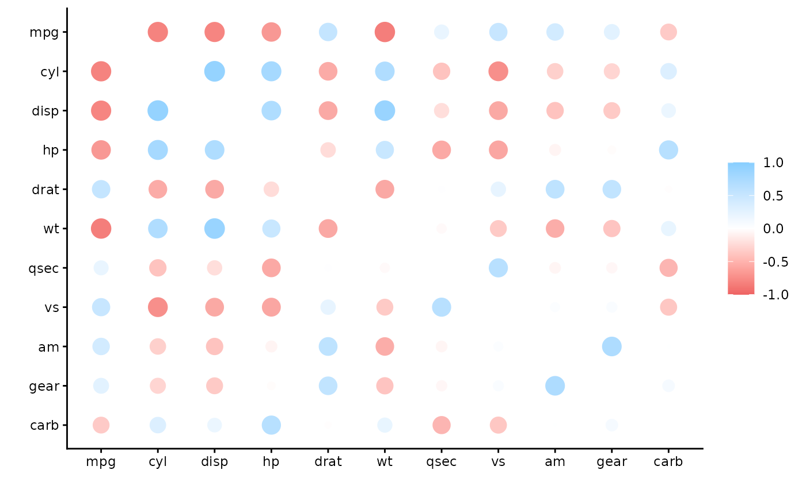

# Using corrr with databases

To calculate correlations with data inside databases, it is very common
to import the data into R and then run the analysis. This is not a
desirable path, because of the overhead created by copying the data into
memory.

Taking advantage of the latest features offered by `dbplyr` and `rlang`,
it is now possible to run the correlation calculation **inside the
database**, thus avoiding importing the data.

## An example

A simple SQLite database will be used to this example. A temporary
database is created, and the `mtcars` data set is copied to it. The
`db_mtcars` variable is only a pointer to the new table inside the
database, it does not hold any data.

``` r
con <- DBI::dbConnect(RSQLite::SQLite(), path = ":dbname:")
db_mtcars <- copy_to(con, mtcars)
```

Even though it is not a formal `data.frame` object, `db_mtcars` can be
use as if it was a `data.frame` and simply pipe it into the
[`correlate()`](https://corrr.tidymodels.org/dev/reference/correlate.md)
function.

The
[`correlate()`](https://corrr.tidymodels.org/dev/reference/correlate.md)
function will check the type of object passed, if it is a
database-backed table, meaning a `tbl_sql()` object class, then it will
use the new `tidyeval` code to calculate the correlations inside the
database. The function will automatically retrieve only the results of
the operation.

``` r
library(dplyr)
library(corrr)
db_mtcars %>%
  correlate(quiet = TRUE)
#> # A tibble: 11 × 12
#>    term     mpg    cyl   disp     hp    drat     wt    qsec     vs
#>    <chr>  <dbl>  <dbl>  <dbl>  <dbl>   <dbl>  <dbl>   <dbl>  <dbl>
#>  1 mpg   NA     -0.852 -0.848 -0.776  0.681  -0.868  0.419   0.664
#>  2 cyl   -0.852 NA      0.902  0.832 -0.700   0.782 -0.591  -0.811
#>  3 disp  -0.848  0.902 NA      0.791 -0.710   0.888 -0.434  -0.710
#>  4 hp    -0.776  0.832  0.791 NA     -0.449   0.659 -0.708  -0.723
#>  5 drat   0.681 -0.700 -0.710 -0.449 NA      -0.712  0.0912  0.440
#>  6 wt    -0.868  0.782  0.888  0.659 -0.712  NA     -0.175  -0.555
#>  7 qsec   0.419 -0.591 -0.434 -0.708  0.0912 -0.175 NA       0.745
#>  8 vs     0.664 -0.811 -0.710 -0.723  0.440  -0.555  0.745  NA    
#>  9 am     0.600 -0.523 -0.591 -0.243  0.713  -0.692 -0.230   0.168
#> 10 gear   0.480 -0.493 -0.556 -0.126  0.700  -0.583 -0.213   0.206
#> 11 carb  -0.551  0.527  0.395  0.750 -0.0908  0.428 -0.656  -0.570
#> # ℹ 3 more variables: am <dbl>, gear <dbl>, carb <dbl>
```

The `tidyeval`-based function ensures that a `cor_df` object is
returned, so then it can be used with other functions in the `corrr`
package.

``` r
db_mtcars %>%
  correlate(quiet = TRUE) %>%
  rplot()
#> Warning: `aes_string()` was deprecated in ggplot2 3.0.0.
#> ℹ Please use tidy evaluation idioms with `aes()`.
#> ℹ See also `vignette("ggplot2-in-packages")` for more information.
#> ℹ The deprecated feature was likely used in the corrr package.
#>   Please report the issue at
#>   <https://github.com/tidymodels/corrr/issues>.
#> This warning is displayed once per session.
#> Call `lifecycle::last_lifecycle_warnings()` to see where this warning
#> was generated.
```



## `sparklyr`

For connections using `sparklyr`, `corrr` will use that package function
called [`ml_corr()`](https://rdrr.io/pkg/sparklyr/man/ml_corr.html) to
run all of the correlations at the same time. That is all done under the
hood. The user just needs to pass a `tbl_spark` object to the
[`correlate()`](https://corrr.tidymodels.org/dev/reference/correlate.md)
function, and `corrr` will automatically select the right function to
run.

## Limitations

When using
[`correlate()`](https://corrr.tidymodels.org/dev/reference/correlate.md)
with a database-backed table, please make sure to keep the following
items in mind:

- Only the **pearson** method is supported. It is the default method, so
  it is not necessary to pass it. But if a different method is chosen,
  then the operation will return an error.

- Only pairwise complete observations are used. Meaning that the `use`
  argument has to be set to `pairwise.complete.obs`.

- The `y` argument is not supported. This means that if 1-to-1
  comparisons are needed, then pre-select the two variables prior
  passing it to the
  [`correlate()`](https://corrr.tidymodels.org/dev/reference/correlate.md)
  function.

- The `diagonal` argument only accepts NA’s.
