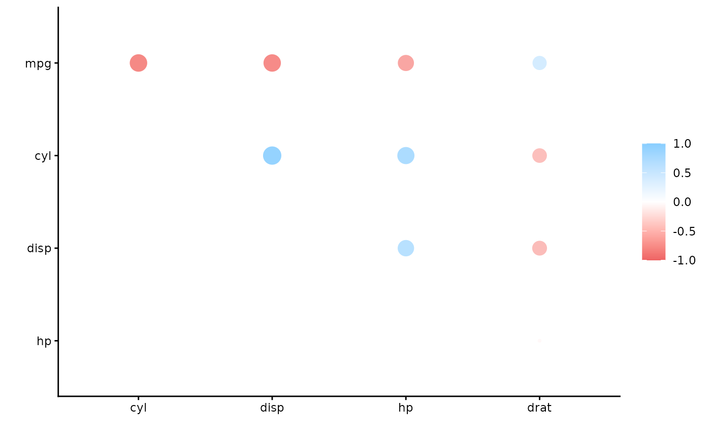
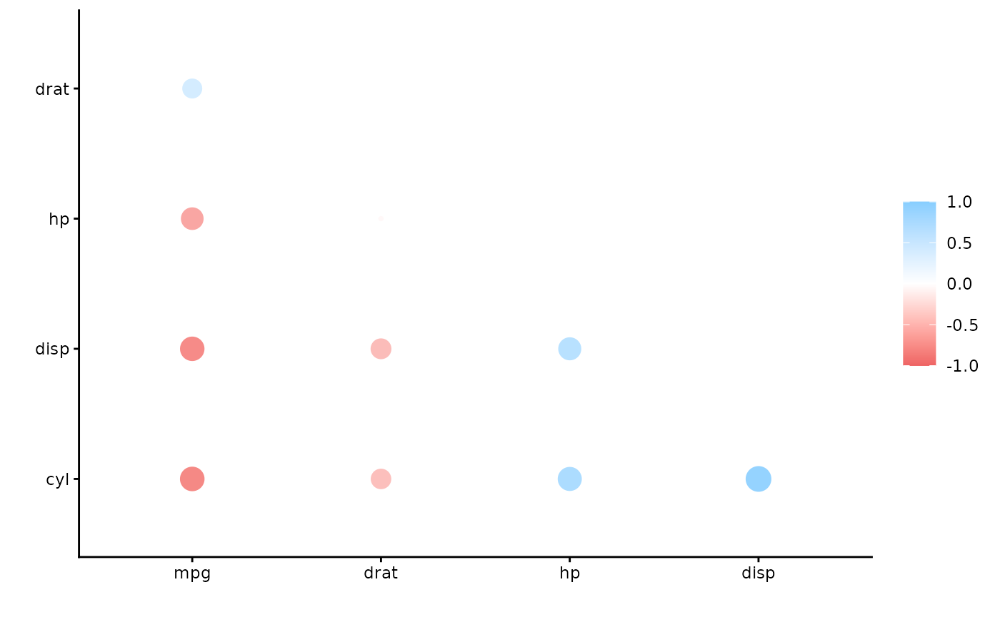

# Using corrr

corrr is a package for exploring **corr**elations in **R**. It makes it
possible to easily perform routine tasks when exploring correlation
matrices such as ignoring the diagonal, focusing on the correlations of
certain variables against others, or rearranging and visualizing the
matrix in terms of the strength of the correlations.

## Using corrr

Using `corrr` starts with
[`correlate()`](https://corrr.tidymodels.org/dev/reference/correlate.md),
which acts like the base correlation function
[`cor()`](https://rdrr.io/r/stats/cor.html). It differs by defaulting to
pairwise deletion, and returning a correlation data frame (`cor_df`) of
the following structure:

- A `tbl` with an additional class, `cor_df`
- An extra “term” column
- Standardized variances (the matrix diagonal) set to missing values
  (`NA`) so they can be ignored.

To work with further, let’s create a correlation data frame using
[`correlate()`](https://corrr.tidymodels.org/dev/reference/correlate.md)
from the `mtcars` data that comes with R:

``` r
library(corrr)
d <- correlate(mtcars, quiet = TRUE)
d
#> # A tibble: 11 × 12
#>    term     mpg    cyl   disp     hp    drat     wt    qsec     vs
#>    <chr>  <dbl>  <dbl>  <dbl>  <dbl>   <dbl>  <dbl>   <dbl>  <dbl>
#>  1 mpg   NA     -0.852 -0.848 -0.776  0.681  -0.868  0.419   0.664
#>  2 cyl   -0.852 NA      0.902  0.832 -0.700   0.782 -0.591  -0.811
#>  3 disp  -0.848  0.902 NA      0.791 -0.710   0.888 -0.434  -0.710
#>  4 hp    -0.776  0.832  0.791 NA     -0.449   0.659 -0.708  -0.723
#>  5 drat   0.681 -0.700 -0.710 -0.449 NA      -0.712  0.0912  0.440
#>  6 wt    -0.868  0.782  0.888  0.659 -0.712  NA     -0.175  -0.555
#>  7 qsec   0.419 -0.591 -0.434 -0.708  0.0912 -0.175 NA       0.745
#>  8 vs     0.664 -0.811 -0.710 -0.723  0.440  -0.555  0.745  NA    
#>  9 am     0.600 -0.523 -0.591 -0.243  0.713  -0.692 -0.230   0.168
#> 10 gear   0.480 -0.493 -0.556 -0.126  0.700  -0.583 -0.213   0.206
#> 11 carb  -0.551  0.527  0.395  0.750 -0.0908  0.428 -0.656  -0.570
#> # ℹ 3 more variables: am <dbl>, gear <dbl>, carb <dbl>
```

## Why a correlation data frame?

At first, a correlation data frame might seem like an unnecessary
complexity compared to the traditional matrix. However, the purpose of
corrr is to help use explore these correlations, not to do mathematical
or statistical operations. Thus, by having the correlations in a data
frame, we can make use of packages that help us work with data frames
like `dplyr`, `tidyr`, `ggplot2`, and focus on using data pipelines.
Lets look at some examples:

``` r
library(dplyr)

# Filter rows to occasions in which cyl has a correlation of .7 or more with
# another variable.
d %>% filter(cyl > .7)
#> # A tibble: 3 × 12
#>   term     mpg   cyl   disp     hp   drat     wt   qsec     vs     am
#>   <chr>  <dbl> <dbl>  <dbl>  <dbl>  <dbl>  <dbl>  <dbl>  <dbl>  <dbl>
#> 1 disp  -0.848 0.902 NA      0.791 -0.710  0.888 -0.434 -0.710 -0.591
#> 2 hp    -0.776 0.832  0.791 NA     -0.449  0.659 -0.708 -0.723 -0.243
#> 3 wt    -0.868 0.782  0.888  0.659 -0.712 NA     -0.175 -0.555 -0.692
#> # ℹ 2 more variables: gear <dbl>, carb <dbl>

# Select the mpg, cyl and disp columns (and term)
d %>% select(term, mpg, cyl, disp)
#> # A tibble: 11 × 4
#>    term     mpg    cyl   disp
#>    <chr>  <dbl>  <dbl>  <dbl>
#>  1 mpg   NA     -0.852 -0.848
#>  2 cyl   -0.852 NA      0.902
#>  3 disp  -0.848  0.902 NA    
#>  4 hp    -0.776  0.832  0.791
#>  5 drat   0.681 -0.700 -0.710
#>  6 wt    -0.868  0.782  0.888
#>  7 qsec   0.419 -0.591 -0.434
#>  8 vs     0.664 -0.811 -0.710
#>  9 am     0.600 -0.523 -0.591
#> 10 gear   0.480 -0.493 -0.556
#> 11 carb  -0.551  0.527  0.395

# Combine above in a single pipeline
d %>%
  filter(cyl > .7) %>% 
  select(term, mpg, cyl, disp)
#> # A tibble: 3 × 4
#>   term     mpg   cyl   disp
#>   <chr>  <dbl> <dbl>  <dbl>
#> 1 disp  -0.848 0.902 NA    
#> 2 hp    -0.776 0.832  0.791
#> 3 wt    -0.868 0.782  0.888
```

Furthermore, by having the diagonal set to missing, we don’t need to put
in extra effort to ignore them when summarizing the correlations. For
example:

``` r
# Compute mean of each column
library(purrr)
d %>% 
  select(-term) %>% 
  map_dbl(~ mean(., na.rm = TRUE))
#>           mpg           cyl          disp            hp          drat 
#> -0.1050454113 -0.0925483176 -0.0872737071  0.0006800268 -0.0037165212 
#>            wt          qsec            vs            am          gear 
#> -0.0828684293 -0.1752247305 -0.1145625942  0.0053087327  0.0484120552 
#>          carb 
#>  0.0563419513
```

### API

As the above section suggests, the corrr API is designed with data
pipelines in mind (e.g., to use `%>%` from the magrittr package). After
[`correlate()`](https://corrr.tidymodels.org/dev/reference/correlate.md),
the primary corrr functions take a `cor_df` as their first argument, and
return a `cor_df` or `tbl` (or output like a plot). These functions
serve one of three purposes:

Internal changes (`cor_df` out):

- [`shave()`](https://corrr.tidymodels.org/dev/reference/shave.md) the
  upper or lower triangle (set to NA).
- [`rearrange()`](https://corrr.tidymodels.org/dev/reference/rearrange.md)
  the columns and rows based on correlation strengths.

Reshape structure (`tbl` or `cor_df` out):

- [`focus()`](https://corrr.tidymodels.org/dev/reference/focus.md) on
  select columns and rows.
- [`stretch()`](https://corrr.tidymodels.org/dev/reference/stretch.md)
  into a long format.

Output/visualizations (console/plot out):

- [`fashion()`](https://corrr.tidymodels.org/dev/reference/fashion.md)
  the correlations for pretty printing.
- [`rplot()`](https://corrr.tidymodels.org/dev/reference/rplot.md) a
  shape for each correlation.
- [`network_plot()`](https://corrr.tidymodels.org/dev/reference/network_plot.md)
  a point for each variable, joined by paths for correlations.

By combing these functions in data pipelines, it’s possible to easily
explore your correlations.

For example, lets focus on the correlations of mpg and cyl with all the
others:

``` r
d %>% focus(mpg, cyl)
#> # A tibble: 9 × 3
#>   term     mpg    cyl
#>   <chr>  <dbl>  <dbl>
#> 1 disp  -0.848  0.902
#> 2 hp    -0.776  0.832
#> 3 drat   0.681 -0.700
#> 4 wt    -0.868  0.782
#> 5 qsec   0.419 -0.591
#> 6 vs     0.664 -0.811
#> 7 am     0.600 -0.523
#> 8 gear   0.480 -0.493
#> 9 carb  -0.551  0.527
```

Or maybe we want to focus in on a few variables (mirrored in rows too)
and print the correlations without an upper triangle and fashioned to
look nice:

``` r
d %>%
  focus(mpg:drat, mirror = TRUE) %>%  # Focus only on mpg:drat
  shave() %>% # Remove the upper triangle
  fashion()   # Print in nice format 
#>   term  mpg  cyl disp   hp drat
#> 1  mpg                         
#> 2  cyl -.85                    
#> 3 disp -.85  .90               
#> 4   hp -.78  .83  .79          
#> 5 drat  .68 -.70 -.71 -.45
```

Alternatively, we can visualize these correlations (let’s clear the
lower triangle for a change):

``` r
d %>%
  focus(mpg:drat, mirror = TRUE) %>%
  shave(upper = FALSE) %>%
  rplot()     # Plot
```



Perhaps we’d like to rearrange the correlations so that the plot becomes
easier to interpret. In this case, we can add
[`rearrange()`](https://corrr.tidymodels.org/dev/reference/rearrange.md)
into our pipeline before shaving one of the triangles (we’ll take
correlation sign into account with `absolute = FALSE`).

``` r
d %>%
  focus(mpg:drat, mirror = TRUE) %>%
  rearrange(absolute = FALSE) %>% 
  shave() %>%
  rplot()
```



## Other Resources

For other resources about how to use `corrr`, you’ll find plenty of
posts explaining functions at [blogR](https://drsimonj.svbtle.com/), or
keep up to date with these on Twitter by following
[@drsimonj](https://twitter.com/drsimonj).
